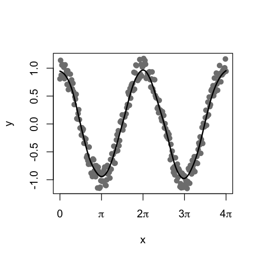
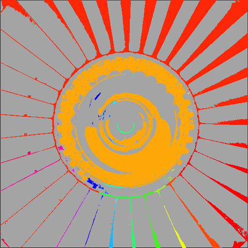
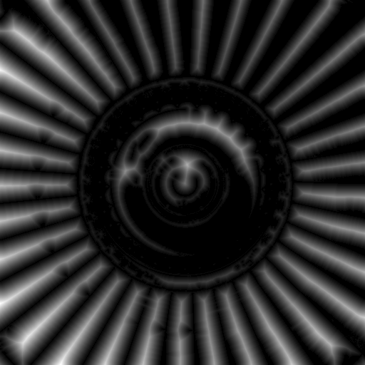
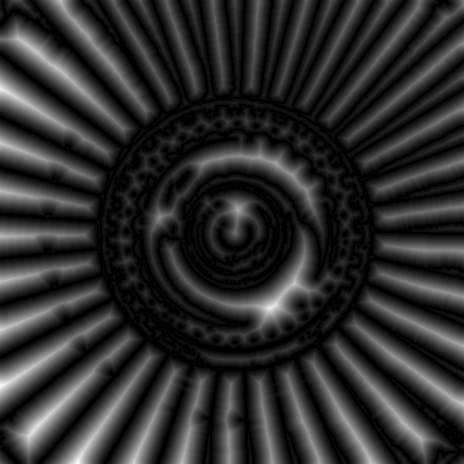
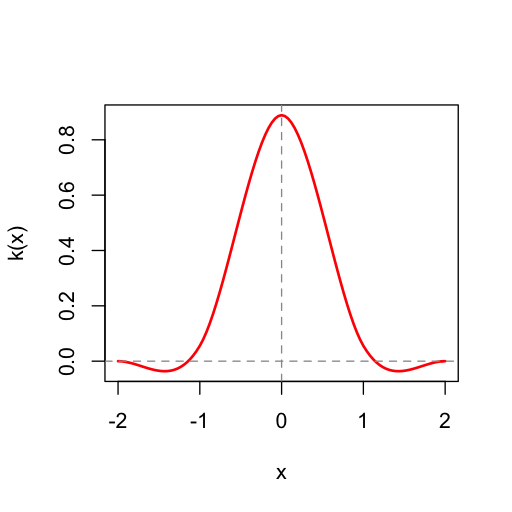

[](https://cran.r-project.org/package=mmand) [](https://github.com/jonclayden/mmand/actions/workflows/ci.yaml) [](https://coveralls.io/github/jonclayden/mmand?branch=master) [](https://tinyverse.netlify.app)

# Mathematical Morphology in Any Number of Dimensions

The `mmand` R package provides tools for performing mathematical morphology
operations, such as erosion and dilation, or finding connected components, on
arrays of arbitrary dimensionality. It can also smooth and resample arrays,
obtaining values between pixel centres or scaling the image up or down
wholesale.

All of these operations are underpinned by three powerful functions, which
perform different types of kernel-based operations: `morph()`, `components()`
and `resample()`.

An additional function provides a multidimensional
[distance transform](#the-distance-transform) operation.

## Contents

- [Test image](#test-image)
- [Mathematical morphology](#mathematical-morphology)
- [Greyscale morphology](#greyscale-morphology)
- [Skeletonisation](#skeletonisation)
- [Smoothing](#smoothing)
- [Connected components](#connected-components)
- [The distance transform](#the-distance-transform)
- [Resampling](#resampling)

## Test image

A test image of a jet engine fan is available within the package, and will be
used for demonstration below. It can be read in and displayed using the code


```r
library(mmand)
library(loder)

fan <- readPng(system.file("images", "fan.png", package="mmand"))
display(fan)
```


Here we are using the [loder](https://github.com/jonclayden/loder) package to
read the PNG file.

## Mathematical morphology

[Mathematical morphology](https://en.wikipedia.org/wiki/Mathematical_morphology) 
is an image processing technique that can be used to emphasise or remove 
certain types of features from binary or greyscale images. It is classically 
performed on two-dimensional images, but can be useful in three or more 
dimensions, as, for example, in medical image analysis. The `mmand` package can 
work on R arrays of any dimensionality, including one-dimensional vectors.

The basic operations in mathematical morphology are *erosion* and *dilation*. A 
simple one-dimensional example serves to illustrate their effects:


```r
x <- c(0,0,1,0,0,0,1,1,1,0,0)
k <- c(1,1,1)
erode(x,k)
##  [1] 0 0 0 0 0 0 0 1 0 0 0
dilate(x,k)
##  [1] 0 1 1 1 0 1 1 1 1 1 0
```

The `erode()` function "thins out" areas in the input vector, `x`, which were 
"on" (i.e. set to 1), to the point where the first of these areas "disappears" 
entirely. Conversely, the `dilate()` function expands these regions into 
neighbouring pixels.

The vector `k` here is called the *kernel* or *structuring element*. It 
effectively controls the region of influence of the operation when it is 
applied to each value.

Derived from these basic operations are the *opening* and *closing* functions. 
These apply both basic operations, using the same kernel, but in different 
orders: an opening is an erosion followed by a dilation, whereas a closing is a 
dilation followed by an opening.


```r
opening(x,k)
##  [1] 0 0 0 0 0 0 1 1 1 0 0
closing(x,k)
##  [1] 0 0 1 0 0 0 1 1 1 0 0
```

Notice that, in this case, the closing gets us back to where we started, 
whereas the opening does not. This is because the initial erosion operation 
removes the first "on" block entirely, so it cannot be recovered by the 
subsequent dilation. Hence, the effect is to remove small features that are
narrower than the kernel.

## Greyscale morphology

Mathematical morphology is not limited to binary data. When generalised to 
greyscale images, erosion replaces each nonzero pixel with the minimum value 
within the kernel when it is centred at that pixel, and dilation uses the 
maximum. For example,


```r
x <- c(0,0,0.5,0,0,0,0.2,0.5,0.3,0,0)
erode(x,k)
##  [1] 0.0 0.0 0.0 0.0 0.0 0.0 0.0 0.2 0.0 0.0 0.0
```

Notice that the remaining nonzero value is now reduced from 0.5 to 0.2, the 
minimum value across the original pixel and its neighbours on either side. With 
a wider kernel, its final value would have dropped to zero.

The effect is more intuitively demonstrated on a real two-dimensional image:


```r
k <- shapeKernel(c(3,3), type="diamond")
display(erode(fan, k))
```


Notice that darker areas appear enlarged. In this case the kernel is itself a 
2D array (or matrix), and unlike the 1D case there is a choice of plausible 
shapes for a particular width. The `shapeKernel()` function will create box, 
disc and diamond shaped kernels, and their higher-dimensional equivalents.

Using a wider kernel exaggerates the effect:


```r
k <- shapeKernel(c(7,7), type="diamond")
display(erode(fan, k))
```


In the case above, the diamond shape of the kernel is obvious in areas where 
the kernel is larger than the eroded features.

Note that the kernel may also be anisotropic, i.e. it may have a different 
width in each dimension:


```r
k <- shapeKernel(c(7,3), type="diamond")
display(erode(fan, k))
```


The effect of dilation is complementary, shrinking dark regions and enlarging 
bright ones:


```r
k <- shapeKernel(c(3,3), type="diamond")
display(dilate(fan, k))
```


In this case the low-intensity and narrow handwriting towards the middle of the 
fan has all but disappeared.

The basic operations can be combined together for other useful purposes. For 
example, the difference between the dilated and eroded versions of an image, 
known as the *morphological gradient*, can be used to show up edges between 
areas of light and dark.


```r
k <- shapeKernel(c(3,3), type="diamond")
display(dilate(fan,k) - erode(fan,k))
```


The [Sobel filter](https://en.wikipedia.org/wiki/Sobel_operator) has a similar
effect.


```r
display(sobelFilter(fan))
```


## Skeletonisation

[Topological skeletonisation](https://en.wikipedia.org/wiki/Topological_skeleton)
is the process of thinning a shape to a medial line or surface representing the
approximate path of the original. It can be thought of as the result of
repeated erosion, up to the point where only a "core" of the shape exists. It
is usually applied to binary data.

As of version 1.5.0, the `mmand` package offers three different skeletonisation
algorithms, with different advantages and limitations. (Please see the
documentation at `?skeletonise` for details.) Below we see the results of
applying each of them in turn to the outline of a capital letter B.


```r
library(loder)
B <- readPng(system.file("images", "B.png", package="mmand"))
k <- shapeKernel(c(3,3), type="diamond")

display(B)
display(skeletonise(B,k,method="lantuejoul"), col="red", add=TRUE)
```


The B is shown alone first, and then with the three skeletons overlaid in red.
(Only the code for generating the first is shown.) Notice that all three
skeletons are reasonable medial paths, but the centre one (using Beucher's
formula) is a little thicker than the others in most places, and only the right
one (using the hit-or-miss transform) is fully self-connected.

## Smoothing

A loosely related operation is [kernel-based 
smoothing](https://en.wikipedia.org/wiki/Kernel_smoother), often used to
ameliorate noise. In this case the kernel is used as a set of coefficients, 
which are multiplied by data within the neighbourhood of each pixel and added 
together. For these purposes the kernel should usually be normalised, so that 
its values add up to one.

Gaussian smoothing is a typical example, wherein our coefficients are given by 
the probability densities of a Gaussian distribution centred at the middle of 
the kernel. The `mmand` package provides the `gaussianSmooth()` function for 
performing this operation. Below we can see an example in one dimension, where 
we create some noisy data and then approximately recover the underlying cosine 
function by applying smoothing.


```r
x <- seq(0, 4*pi, pi/64)
y <- cos(x) + runif(length(x),-0.2,0.2)
y_smoothed <- gaussianSmooth(y, 6)

plot(x, y, pch=19, col="grey50", xaxt="n")
axis(1, (0:4)*pi, expression(0,pi,2*pi,3*pi,4*pi))
lines(x, y_smoothed, lwd=2)
```



It should be borne in mind that the second argument to the `gaussianSmooth()` 
function is the *standard deviation* of the smoothing Gaussian kernel in each 
dimension, rather than the kernel size.

On our two-dimensional test image, which contains no appreciable noise, the 
effect is to blur the picture. Indeed, this operation is sometimes called 
[Gaussian blurring](https://en.wikipedia.org/wiki/Gaussian_blur).


```r
display(gaussianSmooth(fan, c(3,3)))
```


An alternative approach to noise reduction is
[median filtering](https://en.wikipedia.org/wiki/Median_filter), and `mmand`
provides another function for this purpose:


```r
k <- shapeKernel(c(3,3), type="box")
display(medianFilter(fan, k))
```


This method is typically better at preserving edges in the image, which can be 
desirable in some applications.

## Connected components

Every operation described so far has been based on `mmand`'s flexible `morph()` 
function, which uses a kernel represented by an array to select pixels of 
interest in morphing the image, optionally using the kernel's elements to 
adjust their values, and then applying a merge operation of some sort (sum, 
minimum, maximum, median, etc.) to produce the pixel value in the final image. 
In every case the result has the same size as the original data array.

In the next section we will examine operations that change the array's
dimensions, but first we consider another useful operation: finding connected
components. This is the task of assigning a label to each contiguous subregion
of an array.

To demonstrate, we start by first thresholding the fan image using *k*-means
clustering (with *k*=2). The package's `threshold()` function can be used for
this:


```r
fan_thresholded <- threshold(fan, method="kmeans")
display(fan_thresholded)
```


We can then find the connected components. In this case the kernel determines
which pixels are deemed to be neighbours. For example,


```r
k <- shapeKernel(c(3,3), type="box")
fan_components <- components(fan_thresholded, k)
```

Now we can visualise the result by assigning a colour to each component.


```r
display(fan_components, col=rainbow(max(fan_components,na.rm=TRUE)))
```



As we might expect, the largest components—which label only the "on" areas of
the image—correspond to (most of) the ring of fan blades, and the bright part
of the central hub.

This is can be a useful tool for "segmentation", or dividing an image into
coherent areas.

## The distance transform

A useful operation in certain contexts is the distance transform, which
calculates the distance from each pixel to a region of interest. There are
signed an unsigned variants, with the former also calculating the distance
to the boundary within the region of interest itself. We can use the
thresholded image from above to illustrate the point:


```r
display(distanceTransform(fan_thresholded))
```



```r
display(abs(distanceTransform(fan_thresholded, signed=TRUE)))
```



We take the absolute value of the signed transform here for ease of visual
interpretation. Notice how, in both cases, bright "ridges" in the transformed
image correspond to midlines at maximal distance from the boundary between
foreground and background. Philip Rideout
[provides a detailed explanation](https://prideout.net/blog/distance_fields/)
of the algorithm and its uses.

## Resampling

The final category of problems that `mmand` can solve uses a different type of
kernel to resample an image at arbitrary points, or on a new grid. This allows 
images to be resized, or arrays to be indexed using non-integer indices. The 
kernels in these cases are functions, which provide coefficients for using data 
at any distance from the new pixel location to determine its value.

Let's use an example to illustrate this. Consider the simple vector


```r
x <- c(0,0,1,0,0)
```

Its second element is 0, and its third element is 1, but what is its value at 
index 2.5? One answer is that it simply doesn't have one, but if these were 
samples from a fundamentally continuous source, then there is conceptually a 
value everywhere. We just didn't capture it. Our best guess would have to be 
that it is either 0 or 1, or something in between. If we try to use 2.5 as an 
index we get the value 0:


```r
x[2.5]
## [1] 0
```

(R simply truncates 2.5 to 2 and returns element 2.) The `resample()` function 
provides a set of alternatives:


```r
resample(x, 2.5, triangleKernel())
## [1] 0.5
```

Now we obtain the value 0.5, which does not appear anywhere in the original, 
but it is the average of the values at locations 2 and 3. In this case, 
therefore, `resample()` is performing [linear 
interpolation](https://en.wikipedia.org/wiki/Linear_interpolation).

The triangle kernel is just one possible function for interpolating the data. 
Another option is the box kernel, generated by `boxKernel()`, which simply 
returns the "nearest" value in the original data. Yet another option is 
provided by `mitchellNetravaliKernel()`, or `mnKernel()` for short, which 
provides a family of cubic spline kernels [proposed by Mitchell and 
Netravali](https://dl.acm.org/doi/10.1145/378456.378514). We can see the profile
of any of these kernels by plotting them:


```r
plot(mitchellNetravaliKernel(1/3, 1/3))
```



In higher dimensions, the resampled point locations can be passed to 
`resample()` either as a matrix giving the points to sample at, one per row, or 
as a list giving the locations on each axis, which will be made into a grid.

A common use for resampling is to scale an image up or down. The `rescale()` 
function is a convenience wrapper around `resample()` for scaling an array by a 
given scale factor. Here, we can use it to scale a smaller version of the fan 
image up to the size of the larger version:


```r
library(loder)

fan_small <- readPng(system.file("images", "fan-small.png", package="mmand"))
dim(fan_small)
## [1] 128 128   1

display(rescale(drop(fan_small), 4, mnKernel()))
```


The scaled-up image of course has less detail than the original 512x512 pixel 
version, since it is based on 16 times fewer data points, but the general 
features of the fan are perfectly discernible.
